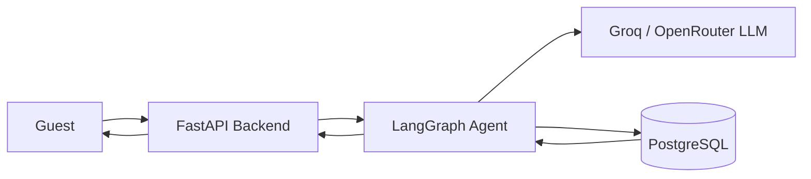

# StayEase AI Agent

This project is a simple AI assistant for StayEase, a short-term accommodation rental platform in Bangladesh. The backend receives guest messages through FastAPI, passes them to a LangGraph agent, and lets the agent decide whether to search listings, return property details, create a booking, or escalate to a human when the request is outside scope. PostgreSQL stores listings, bookings, and conversation history, while a Groq or OpenRouter hosted LLM handles intent understanding and response generation.

## 1. System Overview



## 2. Conversation Flow

Example guest message: "I need a room in Cox's Bazar for 2 nights for 2 guests."

1. The guest message is sent to `POST /api/chat/{conversation_id}/message`.
2. FastAPI loads the existing conversation from PostgreSQL and builds the initial LangGraph state.
3. The `parse_request` node uses the LLM to classify the message as a `search` request and extracts:
   - `location = "Cox's Bazar"`
   - `check_in = "2026-05-10"`
   - `check_out = "2026-05-12"`
   - `guests = 2`
4. The graph routes to `run_tool`, which calls `search_available_properties`.
5. The tool queries PostgreSQL for active listings in Cox's Bazar with enough capacity and no conflicting bookings.
6. The tool returns a short list such as:
   - Sea Breeze Studio - BDT 4,800 per night
   - Kolatoli Family Suite - BDT 6,200 per night
   - Inani Ocean View Room - BDT 5,500 per night
7. The `respond` node turns the tool output into a guest-friendly reply with names, prices, dates, and a follow-up prompt to choose one property.
8. FastAPI stores the guest message and assistant reply in the `conversations` table and returns the response to the client.

## 3. LangGraph State Design

The graph uses a single `TypedDict` state object:

| Field | Type | Why it is needed |
| --- | --- | --- |
| `conversation_id` | `str` | Links the active turn to stored chat history. |
| `messages` | `list[dict[str, str]]` | Keeps the running conversation for the LLM and audit trail. |
| `user_message` | `str` | Stores the newest guest message being processed. |
| `intent` | `Literal["search", "details", "book", "escalate"] \| None` | Tells the graph which path to take next. |
| `search_params` | `SearchParams \| None` | Holds parsed location, dates, and guest count for search. |
| `listing_id` | `str \| None` | Identifies which property the guest is asking about or booking. |
| `booking_request` | `BookingRequest \| None` | Holds the data needed to create a booking. |
| `tool_result` | `dict[str, Any] \| None` | Stores the raw output from the last tool call. |
| `final_response` | `str \| None` | Stores the message that will be returned to the API caller. |
| `needs_human` | `bool` | Flags when the request should be escalated. |

## 4. Node Design

The graph is intentionally small:

| Node | What it does | What it updates | Next node |
| --- | --- | --- | --- |
| `load_context` | Loads prior messages and prepares state for the new turn. | `messages`, `user_message` | `parse_request` |
| `parse_request` | Uses the LLM to detect intent and extract structured fields. | `intent`, `search_params`, `listing_id`, `booking_request`, `needs_human` | Conditional: `run_tool` or `respond` |
| `run_tool` | Calls the correct business tool based on the current intent. | `tool_result` | `respond` |
| `respond` | Builds the final guest-facing reply from state and tool output. | `final_response` | `save_conversation` |
| `save_conversation` | Persists the new turn to the database before returning. | `messages` | `END` |

## 5. Tool Definitions

### `search_available_properties`

- Input parameters:
  - `location: str`
  - `check_in: date`
  - `check_out: date`
  - `guests: int`
- Output format:

```json
{
  "results": [
    {
      "listing_id": "cox-101",
      "title": "Sea Breeze Studio",
      "location": "Cox's Bazar",
      "price_bdt": 4800,
      "max_guests": 2
    }
  ],
  "count": 1
}
```

- Used when the guest wants to find available places for a location, date range, and guest count.

### `get_listing_details`

- Input parameters:
  - `listing_id: str`
- Output format:

```json
{
  "listing_id": "cox-101",
  "title": "Sea Breeze Studio",
  "description": "Private studio near Kolatoli beach.",
  "location": "Cox's Bazar",
  "price_bdt": 4800,
  "max_guests": 2,
  "amenities": ["wifi", "ac", "breakfast"]
}
```

- Used when the guest asks about a specific property after seeing search results.

### `create_booking`

- Input parameters:
  - `listing_id: str`
  - `guest_name: str`
  - `check_in: date`
  - `check_out: date`
  - `guests: int`
- Output format:

```json
{
  "booking_id": "bk-9001",
  "listing_id": "cox-101",
  "status": "confirmed",
  "total_price_bdt": 9600
}
```

- Used when the guest clearly confirms they want to reserve a property.

## 6. Database Schema Design

Only three tables are used.

### `listings`

| Column | Type |
| --- | --- |
| `id` | `UUID PRIMARY KEY` |
| `title` | `VARCHAR(150)` |
| `description` | `TEXT` |
| `location` | `VARCHAR(120)` |
| `price_bdt` | `INTEGER` |
| `max_guests` | `INTEGER` |
| `amenities` | `JSONB` |
| `is_active` | `BOOLEAN` |
| `created_at` | `TIMESTAMP` |

### `bookings`

| Column | Type |
| --- | --- |
| `id` | `UUID PRIMARY KEY` |
| `listing_id` | `UUID REFERENCES listings(id)` |
| `guest_name` | `VARCHAR(120)` |
| `check_in` | `DATE` |
| `check_out` | `DATE` |
| `guests` | `INTEGER` |
| `total_price_bdt` | `INTEGER` |
| `status` | `VARCHAR(30)` |
| `created_at` | `TIMESTAMP` |

### `conversations`

| Column | Type |
| --- | --- |
| `id` | `UUID PRIMARY KEY` |
| `conversation_id` | `VARCHAR(80)` |
| `role` | `VARCHAR(20)` |
| `message` | `TEXT` |
| `metadata` | `JSONB` |
| `created_at` | `TIMESTAMP` |
