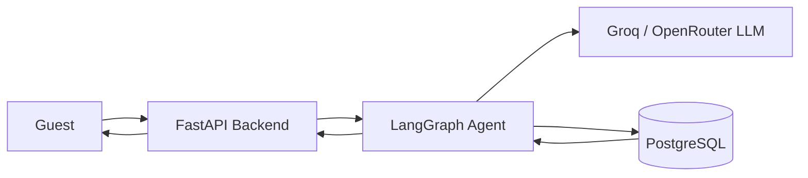

# StayEase AI Agent

This is a small AI agent design for StayEase, a short-term rental platform in Bangladesh. I kept the system simple because the agent only needs to do three things: search properties, show property details, and create a booking. FastAPI handles the API layer, LangGraph controls the agent flow, PostgreSQL stores the data, and Groq or OpenRouter can be used as the LLM provider.

For the code skeleton, I kept the implementation minimal and used sample data in the tool layer so the main focus stays on state design, nodes, and routing.

## 1. System Overview



## 2. Conversation Flow

Example guest message: "I need a room in Cox's Bazar for 2 nights for 2 guests."

1. The guest message is sent to `POST /api/chat/{conversation_id}/message`.
2. FastAPI loads the earlier conversation, if there is one, and builds the initial LangGraph state.
3. For this walkthrough, I am assuming the exact dates are already available in the current session, so `parse_request` figures out that this is a `search` request and extracts:
   - `location = "Cox's Bazar"`
   - `check_in = "2026-05-10"`
   - `check_out = "2026-05-12"`
   - `guests = 2`
4. The graph routes to `run_tool`, which calls `search_available_properties`.
5. The tool checks PostgreSQL for active listings in Cox's Bazar that can take 2 guests and are free for the requested dates.
6. The tool returns a short list such as:
   - Sea Breeze Studio - BDT 4,800 per night
   - Kolatoli Family Suite - BDT 6,200 per night
   - Inani Ocean View Room - BDT 5,500 per night
7. The `respond` node turns that result into a short reply with the listing names and prices.
8. FastAPI sends the reply back to the guest and saves the turn in the conversation history.

## 3. LangGraph State Design

The graph uses one `TypedDict` state object:

| Field | Type | Why it is needed |
| --- | --- | --- |
| `conversation_id` | `str` | Keeps the current turn linked to the right chat. |
| `messages` | `list[dict[str, str]]` | Holds the conversation history for the current run. |
| `user_message` | `str` | Stores the latest guest message. |
| `intent` | `Literal["search", "details", "book", "escalate"] \| None` | Tells the graph what kind of request this is. |
| `search_params` | `SearchParams \| None` | Stores location, dates, and guest count for search. |
| `listing_id` | `str \| None` | Stores the selected listing for details or booking. |
| `booking_request` | `BookingRequest \| None` | Stores the fields needed to make a booking. |
| `tool_result` | `dict[str, Any] \| None` | Stores the output from the tool call. |
| `final_response` | `str \| None` | Stores the final reply that goes back to the guest. |
| `needs_human` | `bool` | Marks requests that should be handed to a human. |

## 4. Node Design

I kept the graph small on purpose:

| Node | What it does | What it updates | Next node |
| --- | --- | --- | --- |
| `load_context` | Adds the latest user message into the current state. | `messages`, `user_message` | `parse_request` |
| `parse_request` | Decides whether the guest wants search, details, booking, or escalation. | `intent`, `search_params`, `listing_id`, `booking_request`, `needs_human` | Conditional: `run_tool` or `respond` |
| `run_tool` | Runs the tool that matches the detected intent. | `tool_result` | `respond` |
| `respond` | Builds the assistant reply from the tool output. | `final_response` | `save_conversation` |
| `save_conversation` | Adds the final reply to the message list so it can be stored. | `messages` | `END` |

## 5. Tool Definitions

### `search_available_properties`

- Input parameters:
  - `location: str`
  - `check_in: date`
  - `check_out: date`
  - `guests: int`
- Output format:

```json
{
  "results": [
    {
      "listing_id": "cox-101",
      "title": "Sea Breeze Studio",
      "location": "Cox's Bazar",
      "price_bdt": 4800,
      "max_guests": 2
    }
  ],
  "count": 1
}
```

- Used when the guest asks to find available places for a location, date range, and guest count.

### `get_listing_details`

- Input parameters:
  - `listing_id: str`
- Output format:

```json
{
  "listing_id": "cox-101",
  "title": "Sea Breeze Studio",
  "description": "Private studio near Kolatoli beach.",
  "location": "Cox's Bazar",
  "price_bdt": 4800,
  "max_guests": 2,
  "amenities": ["wifi", "ac", "breakfast"]
}
```

- Used when the guest asks about one specific property.

### `create_booking`

- Input parameters:
  - `listing_id: str`
  - `guest_name: str`
  - `check_in: date`
  - `check_out: date`
  - `guests: int`
- Output format:

```json
{
  "booking_id": "bk-9001",
  "listing_id": "cox-101",
  "status": "confirmed",
  "total_price_bdt": 9600
}
```

- Used when the guest confirms that they want to reserve a property.

## 6. Database Schema Design

Only three tables are needed for this design.

### `listings`

| Column | Type |
| --- | --- |
| `id` | `UUID PRIMARY KEY` |
| `title` | `VARCHAR(150)` |
| `description` | `TEXT` |
| `location` | `VARCHAR(120)` |
| `price_bdt` | `INTEGER` |
| `max_guests` | `INTEGER` |
| `amenities` | `JSONB` |
| `is_active` | `BOOLEAN` |
| `created_at` | `TIMESTAMP` |

### `bookings`

| Column | Type |
| --- | --- |
| `id` | `UUID PRIMARY KEY` |
| `listing_id` | `UUID REFERENCES listings(id)` |
| `guest_name` | `VARCHAR(120)` |
| `check_in` | `DATE` |
| `check_out` | `DATE` |
| `guests` | `INTEGER` |
| `total_price_bdt` | `INTEGER` |
| `status` | `VARCHAR(30)` |
| `created_at` | `TIMESTAMP` |

### `conversations`

| Column | Type |
| --- | --- |
| `id` | `UUID PRIMARY KEY` |
| `conversation_id` | `VARCHAR(80)` |
| `role` | `VARCHAR(20)` |
| `message` | `TEXT` |
| `metadata` | `JSONB` |
| `created_at` | `TIMESTAMP` |
